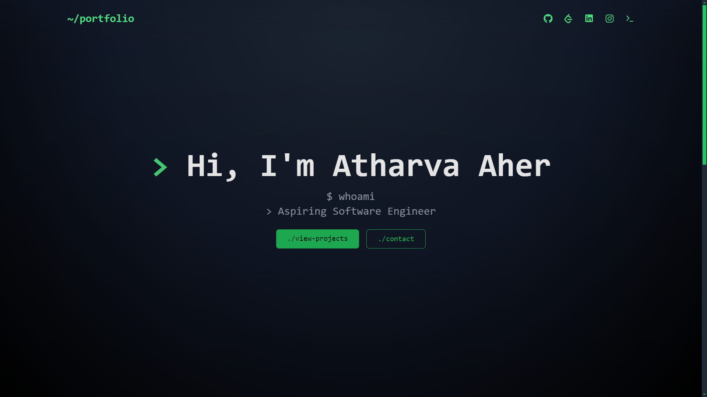

# Terminal-Style Personal Portfolio

A modern, terminal-themed personal portfolio website built with React, Vite, and TailwindCSS. Features a clean, developer-friendly interface with smooth animations and a contact form powered by EmailJS.



## ✨ Features

- 🎯 Linux-inspired design
- 🎨 Smooth animations using Framer Motion
- 📱 Responsive layout
- 📧 Working contact form with EmailJS integration
- 🌙 Dark mode
- 🎉 Modern UI components

## 🚀 Quick Start

### Prerequisites

- Node.js
- npm or yarn
- Git

### Installation

1. Clone the repository:
```bash
   git clone https://github.com/atharva0045/personal-portfolio.git
   cd personal-portfolio
   ```

2. Install dependencies:
```bash
   npm install
   # or
   yarn install
```

3. Create a `.env` file in the root directory:
```env
   VITE_EMAILJS_SERVICE_ID=your_service_id
   VITE_EMAILJS_TEMPLATE_ID=your_template_id
   VITE_EMAILJS_PUBLIC_KEY=your_public_key 
```

4. Start the development server:
```bash
   npm run dev
   # or
   yarn dev
```

### EmailJS Setup

1. Create an account at [EmailJS](https://www.emailjs.com/)
2. Create a new Email Service (Gmail, Outlook, etc.)
3. Create an email template with the following variables:
   - `user_name`
   - `user_email`
   - `message`
4. Get your credentials:
   - Service ID
   - Template ID
   - Public Key
5. Add these credentials to your `.env` file

## 🛠️ Built With

- [React](https://reactjs.org/)
- [Vite](https://vitejs.dev/)
- [TailwindCSS](https://tailwindcss.com/)
- [Framer Motion](https://www.framer.com/motion/)
- [EmailJS](https://www.emailjs.com/)

## 📄 License

This project is open source and available under the [MIT License](LICENSE)

## Support

Give a ⭐️ if you've used the project code for your own portfolio

## 📧 Contact

If you want to contact me, you can reach me through my portfolio website